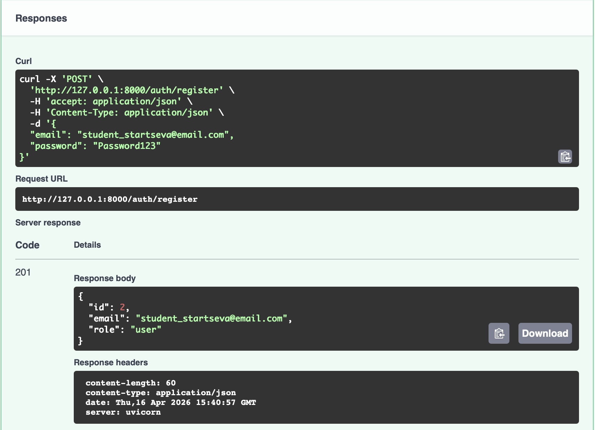
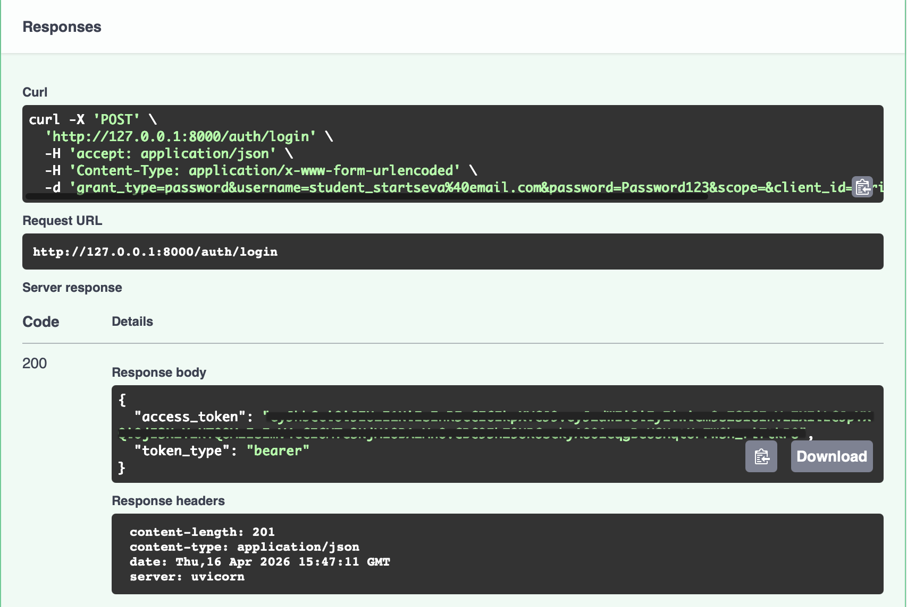
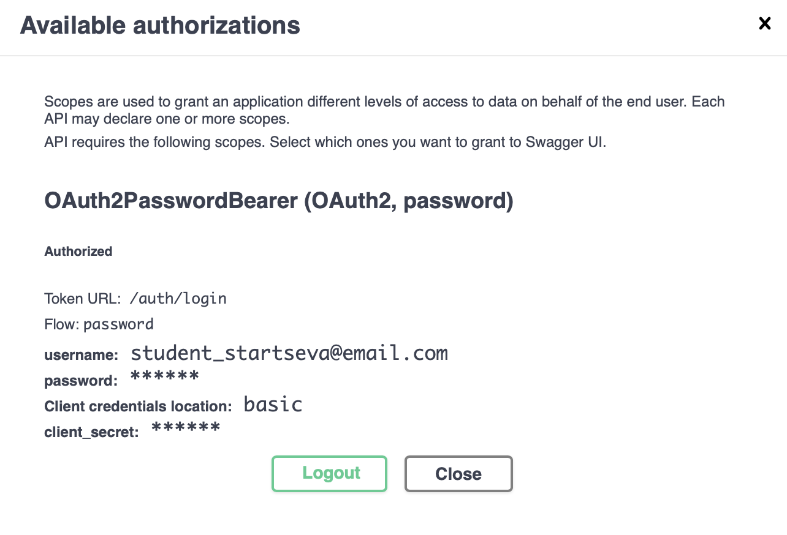
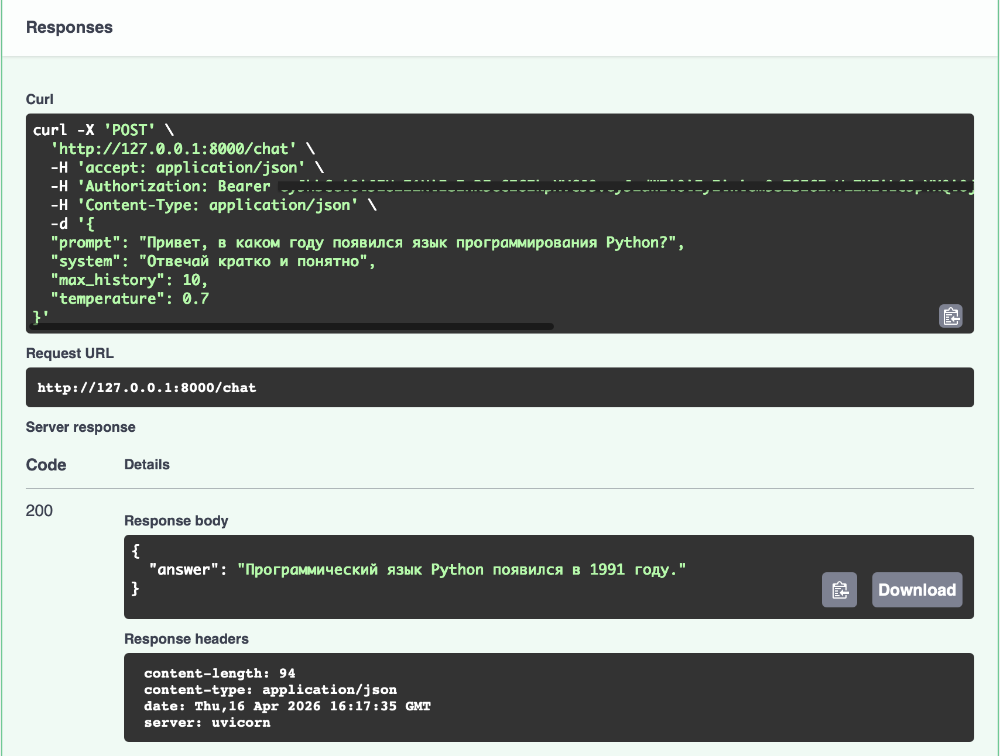
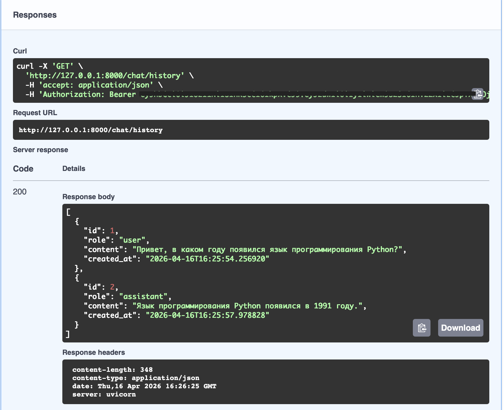
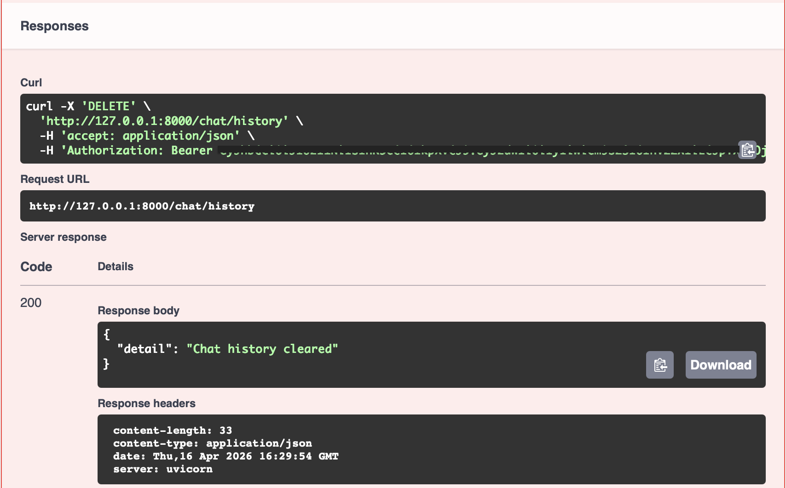

# Защищённый API для работы с LLM на FastAPI

Учебный проект на FastAPI: защищённый API для работы с LLM через OpenRouter

## Описание проекта

В рамках проекта реализован backend-сервис на FastAPI с JWT-аутентификацией, хранением пользователей и истории диалога в SQLite, а также проксированием запросов к большой языковой модели через OpenRouter.

Приложение позволяет:
- зарегистрировать пользователя
- выполнить вход и получить JWT access token
- получить профиль текущего пользователя
- отправить запрос к LLM
- сохранить историю диалога
- получить историю сообщений
- очистить историю диалога

## Стек

- Python 3.11+
- FastAPI
- SQLAlchemy
- SQLite
- Pydantic
- JWT
- OpenRouter
- uv
- ruff

## Структура проекта

```text
llm-p/
├── .env
├── .env.example
├── .gitignore
├── pyproject.toml
├── README.md
├── uv.lock
├── screenshots/
│   ├── auth_register.png
│   ├── auth_login.png
│   ├── authorize.png
│   ├── chat_post.png
│   ├── chat_history_get.png
│   └── chat_history_delete.png
│
├── app/
│   ├── __init__.py
│   ├── main.py
│   │
│   ├── core/
│   │   ├── __init__.py
│   │   ├── config.py
│   │   ├── security.py
│   │   └── errors.py
│   │
│   ├── db/
│   │   ├── __init__.py
│   │   ├── base.py
│   │   ├── session.py
│   │   └── models.py
│   │
│   ├── schemas/
│   │   ├── __init__.py
│   │   ├── auth.py
│   │   ├── user.py
│   │   └── chat.py
│   │
│   ├── repositories/
│   │   ├── __init__.py
│   │   ├── users.py
│   │   └── chat_messages.py
│   │
│   ├── services/
│   │   ├── __init__.py
│   │   └── openrouter_client.py
│   │
│   ├── usecases/
│   │   ├── __init__.py
│   │   ├── auth.py
│   │   └── chat.py
│   │
│   └── api/
│       ├── __init__.py
│       ├── deps.py
│       ├── routes_auth.py
│       └── routes_chat.py
│
└── app.db
```

## Запуск проекта

### 1. Установить uv
```bash
python3 -m pip install uv
```

### 2. Создать виртуальное окружение
```bash
uv venv
source .venv/bin/activate
```

### 3. Установить зависимости
```bash
uv pip install -r <(uv pip compile pyproject.toml)
```

### 4. Заполнить .env
Создайте файл `.env` на основе `.env.example` и укажите `OPENROUTER_API_KEY`.

При недоступности модели `stepfun/step-3.5-flash:free` можно заменить её на:
`OPENROUTER_MODEL=openrouter/free`

### 5. Запустить приложение
```bash
uv run uvicorn app.main:app --host 127.0.0.1 --port 8000
```
После запуска будут доступны:
- Swagger UI: `http://127.0.0.1:8000/docs`
- health-check: `http://127.0.0.1:8000/health`

## Эндпоинты

### Auth
- `POST /auth/register` — регистрация пользователя
- `POST /auth/login` — логин и получение JWT access token
- `GET /auth/me` — профиль текущего пользователя

### Chat
- `POST /chat` — отправка запроса к LLM
- `GET /chat/history` — получение истории диалога
- `DELETE /chat/history` — очистка истории

### Service
- `GET /health` — проверка состояния приложения

## Проверка работы
Проверка выполнялась через Swagger UI.

### 1. Регистрация пользователя
Для проверки использовался email в формате:
student_startseva@email.com



### 2. Логин и получение JWT



### 3. Авторизация через Swagger



### 4. Запрос к LLM через `POST /chat`



### 5. Получение истории через `GET /chat/history`



### 6. Очистка истории через `DELETE /chat/history`



### Пример ответа `/health`
```json
{
  "status": "ok",
  "environment": "local"
}
```

## Примечания
- Пароли хранятся в базе только в виде хеша
- Защищённые эндпоинты доступны только после авторизации
- История сообщений привязана к конкретному пользователю
- Модель LLM настраивается через `.env`
- Если указанная модель OpenRouter недоступна, можно заменить значение `OPENROUTER_MODEL` на другую доступную модель без изменения кода приложения